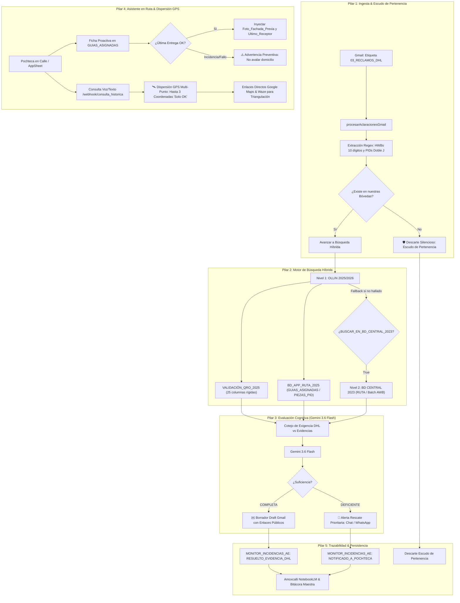

# 📜 AMOXCALLI: BOT DE ACLARACIONES DE SERVICIO AL CLIENTE Y ASISTENTE EN RUTA (FRENTE 5)
**Ecosistema OLLIN — Arauto Express (Plaza Querétaro / León / Sierra Gorda)**  
**Versión:** 2.0.0 MASTER PRODUCTION (Calpixqui, Filtro 'Solo OK' & Dispersión GPS Multi-Punto)  
**Fecha de Implementación:** 2026-09-22  
**Autor:** Antigravity (Google DeepMind) & Sidharta Santiago Garduño (Tlayacanqui)  

---

## 🏛️ 1. CONTEXTO Y PROPÓSITO OPERATIVO

El **Frente 5: Aclaraciones de Servicio al Cliente, Reclamos DHL y Asistente Histórico en Ruta** cumple dos funciones críticas y sinérgicas dentro del Ecosistema OLLIN:

1. **Ingesta y Resolución Autónoma de Aclaraciones DHL (Bandeja ➔ POD):**  
   Monitorea la etiqueta de Gmail `03_RECLAMOS_DHL`, aplica el *Escudo de Pertenencia a Bóveda* para descartar guías foráneas de otros Service Centers, ejecuta Búsqueda Híbrida en Bóvedas (Nivel 1 OLLIN 2025/2026 + Nivel 2 Fallback BD Central 2023) y evalúa cognitivamente las evidencias con Gemini 3.6 Flash. Si la prueba es completa, genera el borrador formal de respuesta; si es incompleta, emite alertas de rescate al Pochteca.
2. **Asistente Inteligente de Domicilios y Coordenadas en Ruta (Calle ➔ Pochteca):**  
   Sirve como copiloto para los Pochtecas en calle mediante dos mecanismos:
   - **Ficha Proactiva en AppSheet con Filtro 'Solo OK':** En `GUIAS_ASIGNADAS`, inyecta la foto de fachada previa y el último receptor únicamente si la entrega histórica fue exitosa. Ante incidencias o entregas fallidas previas, emite una advertencia preventiva prohibiendo referencias falsas.
   - **Dispersión GPS Multi-Punto para Zonas Rurales / Baja Señal:** A través de notas de voz o texto hacia Calpixqui (`/webhook/consulta_historica`), si el chofer indica que la ubicación no coincide o solicita más referencias, el motor extrae hasta 3 coordenadas colindantes con entrega 'OK' en la misma calle o C.P. para permitir la triangulación exacta en Google Maps y Waze.

---

## 🧩 2. ARQUITECTURA GENERAL DEL SISTEMA (5 PILARES)

---

## 🛡️ 3. DETALLE DE LOS 5 PILARES OPERATIVOS

### Pilar 1: Ingesta y 'El Escudo de Pertenencia' (`procesarAclaracionesGmail`)
- **Monitoreo Automatizado:** Trigger de ejecución cada 10 minutos sobre la etiqueta Gmail `03_RECLAMOS_DHL`.
- **Análisis de Hilos Extensos:** Inspecciona todos los mensajes del hilo (`thread.getMessages()`), recopilando correos reenviados, tablas pegadas y encabezados.
- **Extracción Quirúrgica de Identificadores:**
  - *HWBs de DHL:* Expresión regular `\b\d{10}\b` (10 dígitos).
  - *Piece IDs (PIDs):* Expresión regular `\b(?:JJD|JD)[0-9A-Z]{14,24}\b` con sanitización obligatoria inmediata según la **Ley de la Doble J** (`JJD` ➔ `JD`).
- **El Escudo de Pertenencia a Bóveda:** Muchos hilos de DHL provienen de centros de servicio externos (GDL, MTY, CDMX). El bot valida si la guía o PID existe en los índices de nuestras Bóvedas locales (QRO / LEN / Sierra Gorda). Si no existe, se descarta silenciosamente, protegiendo las estadísticas operativas de falsas incidencias.

---

### Pilar 2: Motor de Búsqueda Híbrida Escalonada
Asegura continuidad operativa total entre la nueva arquitectura de datos y los repositorios históricos:
1. **Nivel 1 (Producción Activa OLLIN 2025/2026):**
   - **`VALIDACIÓN_QRO_2025`** (`1tkfIyZIO2UxzSHFNRPFssRKOpkOscn7qNbkYA7SXr0M`): Búsqueda en la matriz canónica de 25 columnas base 0:
     - Col A (0): `Guia`
     - Col B (1): `PID` (Sanitizado JD)
     - Col C (2): `C.P.`
     - Col E, F, G (4, 5, 6): Dirección
     - Col H (7): `Receiver Name`
     - Col I (8): `GPS`
     - Col J (9): `Checkpoint`
     - Col N (13): `Imagen fachada`
     - Col O (14): `ID correo` (Pochteca)
     - Col T (19): `Firma`
     - Col U (20): `Telefono`
   - **`BD_APP_RUTA_2025`** (`1Rj7Ce6jWIFTXTamfcgO2h-uhFKBuNhSB8m_tBY_g__w`): Pestaña `PIEZAS_PID` (evidencias multimedia de calle) y `GUIAS_ASIGNADAS` (manifiesto de ruta, notas de voz Teoyolotl).
2. **Nivel 2 (Fallback Histórico - BD CENTRAL 2023):**
   - Habilitado por la variable de entorno `BUSCAR_EN_BD_CENTRAL_2023=true` en `.env` de Calpixqui y ScriptProperties de Google Apps Script.
   - **`BD CENTRAL 2023`** (`1osolxYzL12I05J2CUy5PBAGpPD2Z3XeU37RzUlFPPO8`): Búsqueda en pestaña `RUTA` y `Batch AWB` para guías previas a la migración 2025.

---

### Pilar 3: Evaluación Cognitiva de Evidencias (Gemini 3.6 Flash)
El Agente Calpixqui realiza un cotejo cognitivo multimodal entre lo que exige DHL (POD firmado, confirmación de receptor, fotografía de fachada) vs. las evidencias registradas en Bóveda:
- **EVIDENCIA COMPLETA:** Se genera un borrador de respuesta en el mismo hilo de Gmail (`createDraftReplyAll()`) con formato corporativo HTML, tabla de auditoría, enlaces públicos convertidos de Drive/AppSheet y transcripción de audio del chofer. Estatus: `RESUELTO_EVIDENCIA_DHL`.
- **EVIDENCIA DEFICIENTE / INCOMPLETA:** El sistema identifica la prueba faltante (ej. falta firma autógrafa, foto sin fachada legible o falta de coordenadas) y despacha una **Alerta de Rescate Prioritaria** al Pochteca y supervisores vía **Google Chat** y **WhatsApp**, ordenando la re-visita antes del corte de las 18:00 hrs. Estatus: `NOTIFICADO_A_POCHTECA`.

---

### Pilar 4: Asistente Histórico en Ruta y Dispersión GPS Multi-Punto

#### A) Ficha Proactiva en AppSheet (Filtro de Calidad 'Solo OK')
- **Inyección en `GUIAS_ASIGNADAS` (`inyectarReferenciasPreviasGuiasAsignadas`):**
  Al cargarse la ruta matutina, el sistema busca entregas previas en el mismo domicilio/cliente en Bóvedas.
  - **Entrega Previa 'OK':** Si el estatus fue `'OK'`, `'ENTREGADO'` o `'ENTREGA EXITOSA'`, inyecta en la ficha del Pochteca la columna `Foto_Fachada_Previa`, `Ultimo_Receptor` y `GPS_Referencia`.
  - **Entrega Previa Fallida / Incidencia:** Si la última visita tuvo estatus negativo (`CERRADO`, `RECHAZADO`, `DIRECCION_ERRONEA`), el sistema **NO** inyecta la foto de fachada como positiva. En su lugar, inyecta en `Alerta_Direccion_Previa`:
    `⚠️ PRECAUCIÓN: Última visita con incidencia [CERRADO]. No usar como referencia positiva. Verificar con el cliente antes de acudir.`

#### B) Consulta por Voz/Texto a CALPIXQUI (`/webhook/consulta_historica`)
- **Atención Conversacional:** Los Pochtecas consultan por WhatsApp, Chat o AppSheet enviando dirección, nombre de cliente o una nota de voz. Si envían audio, Gemini 3.6 Flash lo transcribe y extrae la intención y dirección.
- **Tolerancia a Zonas Rurales / Baja Señal (Dispersión GPS Multi-Punto):**
  Si el operador indica que la ubicación no coincide ("dame más referencias", "no coincide", "dispersión GPS", o zona rural sin número exterior claro), Calpixqui extrae de Bóvedas **hasta 3 coordenadas GPS colindantes con entrega 'OK' en la misma calle o C.P.**
- **Triangulación Exacta:** Para cada punto genera enlaces directos a Google Maps (`https://www.google.com/maps/search/?api=1&query=lat,lon`) y Waze (`https://waze.com/ul?ll=lat,lon&navigate=yes`), calculando la dispersión en metros mediante la fórmula de Haversine para que el chofer triangule la ubicación exacta en terreno.

---

### Pilar 5: Registro y Auditoría en `MONITOR_INCIDENCIAS_AE`
Cada reclamo, evaluación y resolución se asienta en el libro central:
- **Spreadsheet ID:** `15XPRq79p0Z_jcKoxc_Sc_FKOQNHj8V2EYwn8Q1Mbqc0`
- **Pestaña:** `ACLARACIONES_DHL`
- **Esquema de 18 Columnas:**
  `Ticket_ID | Fecha_Ingreso | HWB_Guia | Piece_ID | Remitente_DHL | Asunto_Correo | Tipo_Reclamo | Pochteca_Responsable | Plaza | Fuente_Boveda | Suficiencia_Evidencias | Evidencias_Detectadas | Faltantes | Estatus_Ticket | Dictamen_IA | Borrador_Generado | ID_Hilo_Gmail | Ultima_Actualizacion`

---

## 🔒 4. CANDADOS INMUTABLES Y REGLAS DE NEGOCIO APLICADAS

| Candado | Regla Operativa | Salvaguarda Técnica |
|:---|:---|:---|
| **1. Ley de la Doble J** | PIDs en calle son `JJD` (3 letras); en Bóveda/Sheets son `JD` (2 letras). | `sanitizar_pid_para_boveda()` ejecutado en todo punto de entrada en GAS y Python. |
| **2. Esquema 25 Columnas** | Prohibido el column shifting en `VALIDACIÓN_QRO_2025`. | Lectura fija por índices inmutables (Col A=0, Col B=1, Col Q=16, Col U=20). |
| **3. Filtro 'Solo OK'** | Ninguna foto de entrega fallida puede ser sugerida como referencia positiva. | `calidad_aprobada_solo_ok` valida checkpoints exitosos antes de inyectar foto/receptor. |
| **4. Poka-Yoke de Borradores** | Jamás enviar respuestas ciegas por correo sin revisión humana. | Se generan como borradores en Gmail (`createDraftReplyAll()`) para validación en 1 clic. |
| **5. Triangulación Rural** | Máximo 3 coordenadas colindantes validadas 'OK' con enlaces móviles. | Generación de links directos a Google Maps y Waze con cálculo de dispersión en metros. |

---

## 📂 5. INVENTARIO DE ARCHIVOS IMPLEMENTADOS

1. **`Fuentes_OLLIN/servidor_secundario/frente5_aclaraciones_bot.py`:**
   - Motor en Python del Bot de Aclaraciones y Asistente de Referencias Históricas.
   - Implementa `buscar_referencias_historicas_direccion()`, `consultar_asistente_ruta()`, cálculo de distancia Haversine y enlaces de mapas.
2. **`Fuentes_OLLIN/servidor_secundario/hermes_ollin_worker.py`:**
   - Servidor FastAPI con soporte de endpoints:
     - `POST /webhook/aclaracion` (Ingesta y evaluación cognitiva de correos DHL).
     - `POST /webhook/consulta_historica` (Asistente en ruta con dispersión GPS multi-punto).
3. **`Bot_Aclaraciones_Frente5.gs` (Google Apps Script):**
   - Motor de ingesta Gmail (`procesarAclaracionesGmail`), Escudo de Pertenencia, Búsqueda Híbrida y Ficha Proactiva en `GUIAS_ASIGNADAS`.
   - Secciones 10, 11 y 12: `inyectarReferenciasPreviasGuiasAsignadas()`, `obtenerReferenciasGPSMultiPunto()` y `procesarConsultaHistoricaGAS()`.
4. **`Code.gs`:**
   - Exposición en `doGet()` y `doPost()` de las acciones `consulta_historica`, `inyectar_referencias_previas` y `procesar_aclaraciones`.
5. **`Fuentes_OLLIN/servidor_secundario/test_frente5_completo.py`:**
   - Suite de 7 pruebas unitarias e integración que valida el 100% de los componentes con Mock de Bóvedas.

---

*Documento canónico preservado en Amoxcalli para la gobernanza técnica permanente del Ecosistema OLLIN.*
